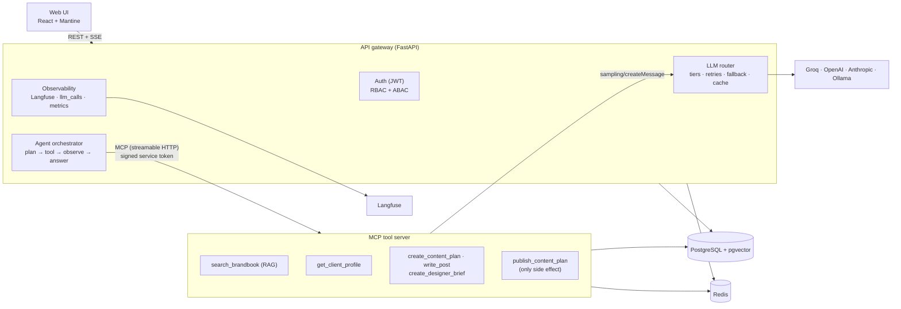
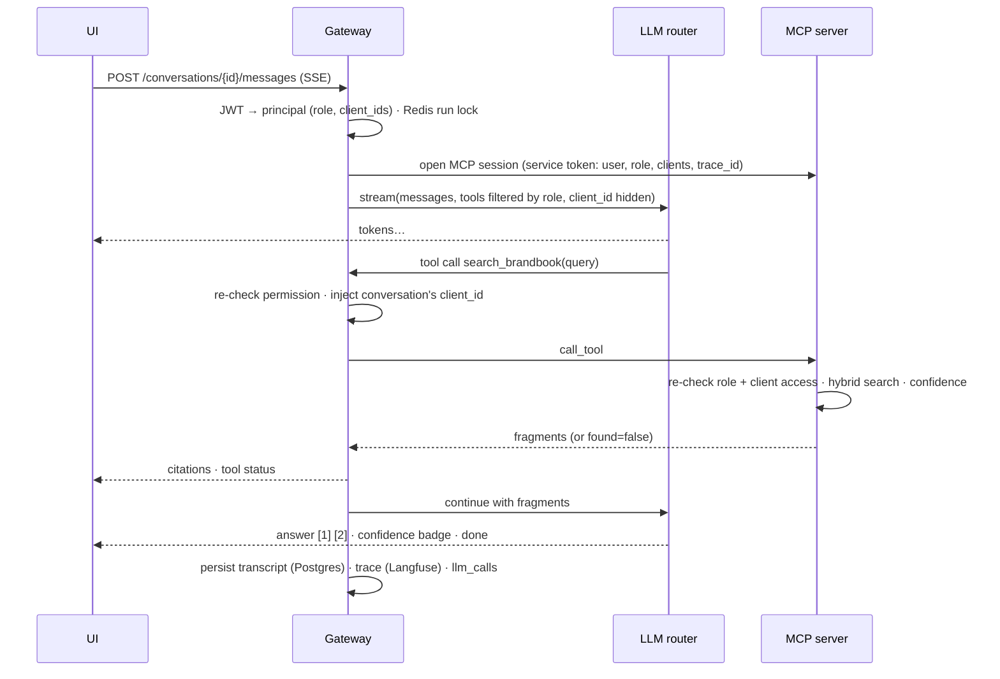

# Brand Assistant

[](https://github.com/Gervantt/Brand-Assistant/actions/workflows/ci.yml)

**An internal AI assistant for a creative agency** — a multi-step LLM agent with MCP tools,
role-based access, hybrid RAG over client brand books, and full observability.

> **Live demo:** _coming soon_ (Vercel + Render) · one-click demo logins for every role
>
>  <!-- TODO: record a 30-second GIF: login → brand-book question → content plan → publish -->

## What it is and why

Agency staff upload a client's brand book and brief; the assistant then answers questions about
tone of voice, colours, audience and taboos **with citations**, drafts a week or month of content
(platform, date, rubric, copy, hashtags, visual idea), writes posts and stories in the brand's
voice, prepares designer briefs, and — for managers — publishes an approved content plan.

The interesting part is not the chat UI but what sits behind it. It is built the way a production
LLM feature has to be built:
- **Pluggable models.** Swapping the model is a one-line config change, with fallback chains and
  complexity-based routing.
- **Tools as an MCP server.** The agent's tools live in a separate MCP server.
- **Permissions enforced three times.** A prompt-injected model still can't publish or read
  another client's data.
- **Honest answers.** Answers are grounded and the assistant says *"it isn't in the brand book"*
  instead of improvising.
- **Every call is measured.** Each LLM call is traced, priced and aggregated.

The UI is deliberately plain. Most of the effort went into the backend, and the backend is
evaluated with a reproducible retrieval benchmark.

## Features

| Area | What you get |
|---|---|
| **Agent** | Plan → tool → observation → answer loop (max 8 steps), SSE streaming of tokens and tool statuses («Ищу в брендбуке…»), conversation history in Postgres, run lock/state in Redis |
| **LLM router** | One interface over **Groq, OpenAI, Anthropic, Ollama**; simple/complex tiers; per-call timeouts, exponential backoff, fallback chain; structured output with one self-repair; token & $ accounting per call |
| **MCP tool server** | `search_brandbook`, `get_client_profile`, `create_content_plan`, `write_post`, `create_designer_brief`, `publish_content_plan` (+ internal `ingest_document`); generation tools call the LLM through **MCP sampling** |
| **Access control** | JWT auth; roles viewer → copywriter → manager → admin (RBAC); per-client assignments (ABAC); tools filtered before the model sees them **and** re-checked on every call, on the gateway **and** on the MCP server |
| **RAG** | PDF/DOCX/MD ingestion, heading-aware chunking, pgvector HNSW + IDF-weighted Postgres full-text, Reciprocal Rank Fusion, optional multilingual cross-encoder, citations, confidence gate |
| **Observability** | Langfuse traces (one per request: agent → generations → tools), `llm_calls` table, `/admin/metrics` (avg/p95 latency, cost per day/model, error & fallback rates), Redis response cache with "saved $" |
| **Demo safety** | 20 agent requests/hour per user, login throttling, a global daily token budget, seeded demo accounts with one-click login, secrets only via env |

## Architecture



A brand-book question, end to end:



## Quick start

Requirements: Docker. Python tooling is only needed for running tests: [uv](https://docs.astral.sh/uv/).

```bash
cp .env.example .env          # add GROQ_API_KEY (free at console.groq.com)
docker compose up             # api :8000 · web :5173 · mcp · postgres · redis
open http://localhost:5173    # click "Войти как менеджер"
```

The first start downloads the embedding model (~220 MB) and the local reranker (~1.1 GB) into a
Docker volume, then ingests the two demo brand books. Without an LLM key everything still runs;
the chat answers with a clear "no LLM provider configured" error.

| Optional profile | Command | What it adds |
|---|---|---|
| Langfuse (self-hosted) | `docker compose --profile observability up -d` | Tracing UI at http://localhost:3000 (`admin@brand.local` / `brand-langfuse`); then set `LANGFUSE_PUBLIC_KEY=pk-lf-brand-local`, `LANGFUSE_SECRET_KEY=sk-lf-brand-local`, `LANGFUSE_HOST=http://langfuse-web:3000` in `.env` |
| Local LLM | `docker compose --profile ollama up -d` then `docker compose exec ollama ollama pull qwen3:4b` (and `qwen3:8b` for the complex tier) | Set `OLLAMA_BASE_URL=http://ollama:11434` and `LLM__PROVIDER=ollama` |

Development:

```bash
uv sync --all-packages                       # Python 3.12 workspace (api, mcp_server, shared)
docker compose up -d postgres redis
uv run pytest                                # 247 tests, real Postgres/Redis/embeddings
uv run ruff check . && uv run mypy .         # strict typing everywhere
cd apps/web && npm ci && npm run dev         # UI with hot reload
scripts/smoke.sh                             # end-to-end smoke test against the compose stack
```

### Demo accounts

| Account | Role | Can |
|---|---|---|
| `viewer@demo.com` | viewer | ask about the **Bean There** brand book |
| `copywriter@demo.com` | copywriter | + generate plans, posts, briefs; upload documents (Bean There) |
| `manager@demo.com` | manager | + publish content plans; both clients |
| `admin@demo.com` | admin | everything, all clients, `/admin/metrics` |

Password = `DEMO_PASSWORD` (local default `demo-password`); the login page buttons don't need it.

## Switching the model is configuration, not code

`config/local.yaml`:

```yaml
llm:
  provider: groq            # ← groq | openai | anthropic | ollama
  fallback:                 # tried in order when the primary fails
    - groq/qwen/qwen3.8-27b # another Groq model = a separate rate-limit bucket
    - openai
    - anthropic
  classifier: heuristic     # simple questions → cheap model, generation → strong model
```

Or without touching files: `LLM__PROVIDER=anthropic docker compose up`. Each provider maps
`simple`/`complex` tiers to models (e.g. Groq `gpt-oss-20b` / `gpt-oss-120b`, Anthropic
`claude-haiku-4-5` / `claude-opus-5-5`); providers without a key are skipped automatically.

## Demo scenarios

1. **Viewer — honest answers.** «Какие фирменные цвета у бренда?» → answer with `[1]` citations
   and a "Подтверждено брендбуком" badge. «Какой пароль от Wi-Fi?» → "в брендбуке этого нет" and
   a clarifying question. Generation tools are invisible to this role.
2. **Copywriter — generation.** «Составь контент-план на неделю для Instagram и Telegram» →
   status «Составляю контент-план…», then a table (date, platform, rubric, copy, hashtags,
   visual). «Напиши пост…», «Подготовь бриф для дизайнера…» → cards. «Опубликуй план» → the
   assistant explains this needs a manager (the call is blocked by the gateway, see logs).
3. **Manager — publishing.** Generate a plan and press **Опубликовать** → it appears under
   «Утверждённые планы». Switch the client to PeakForm — different brand book, different answers.
4. **Admin — operations.** Upload a PDF/DOCX on «Документы»; open «Метрики» for latency, cost,
   error/fallback rates and cache savings; open the Langfuse trace of any answer.

## Evaluation

`evals/brandbook_qa.jsonl`: **45 questions** over the two demo brand books — 40 with a reference
answer and an exact evidence quote, 5 off-topic questions that must be declined.

### Retrieval

`uv run python -m evals.run_evals retrieval` — real models, real Postgres; a hit is relevant if it
contains the evidence quote.

<!-- generated by evals/run_evals.py on 2026-10-08: 45 questions, 40 answerable, 5 off-topic -->
| Configuration | Recall@1 | Recall@3 | Recall@5 | MRR@10 | Found (answerable) | Abstained (off-topic) | p95, ms |
|---|---|---|---|---|---|---|---|
| vector only | 0.57 | 0.88 | 0.95 | 0.74 | 0.95 | 0.80 | 14 |
| lexical only (IDF) | 0.75 | 0.90 | 0.95 | 0.83 | 0.90 | 1.00 | 13 |
| hybrid (RRF) | 0.70 | 0.95 | 0.97 | 0.83 | 0.95 | 0.80 | 14 |
| hybrid + reranker | **0.88** | **0.97** | **1.00** | **0.92** | 0.95 | **1.00** | 719 |

What the numbers say:
- **Hybrid search beats either side alone.** It reaches Recall@5 0.97.
- **The reranker earns its cost where it is affordable.** It adds +18 pp Recall@1 and declines
  every off-topic question, but costs ~0.7 s on CPU. So it is **on locally and off on Render's
  free tier** (512 MB RAM).
- **Without the reranker, one off-topic question passes the gate.** «абонемент в фитнес-зал»
  against a sports-store brand book scores 0.43 cosine. The model's self-assessment then lowers
  the answer's combined confidence.

### Answer quality (LLM-as-judge) and model comparison

`uv run python -m evals.run_evals generation --models groq/openai/gpt-oss-20b,groq/openai/gpt-oss-120b --judge groq/openai/gpt-oss-120b`

Each model answers from the same retrieved fragments under the agent's grounding rules; a fixed
judge grades correctness against the reference, groundedness, and correct abstention.

| Model | Accuracy | Partial | Grounded | Abstained (off-topic) | False abstention | p95, ms | Cost (45 q), $ |
|---|---|---|---|---|---|---|---|
| groq/openai/gpt-oss-20b | 0.90 | 0.03 | 0.93 | 1.00 | 0.07 | 783 | 0.0037 |
| groq/openai/gpt-oss-120b | **0.93** | 0.00 | 0.93 | 1.00 | 0.07 | 6071* | 0.0075 |

\* includes waiting out Groq's free-tier 8K tokens/minute limit: the judge runs on the same
model and shares its per-minute budget, so this is not the model's raw latency.

Both models decline every off-topic question and stay grounded. The small model is ~3 points
less accurate at half the cost, which is why it serves the *simple* tier (brand-book Q&A) and
the 120B model serves generation. The 7% false abstentions are questions where retrieval found
the fragment but the model still said "not in the brand book". These are the next thing to fix:
prompt tuning or reranker-ordered fragments.

## Security model

- **Tool filtering.** The model only ever sees tools its user's role permits. `client_id` is
  removed from tool schemas and injected by the gateway from the conversation, so a model can't
  aim a tool at another client.
- **Gateway re-check.** Every tool call the model emits is re-checked on the gateway, because a
  model can still emit any tool name. Blocked calls never reach the MCP server and are logged.
- **MCP server re-check.** The MCP server re-checks role and client access from a short-lived
  signed service token. This runs as the tool's first resolver, so a denied call never triggers
  LLM sampling. Requests without a valid token get a 401 before MCP parses anything.
- **Prompt-injection hygiene.** Retrieved text and tool results are data, never instructions. The
  system prompt says so, and off-topic retrieval returns no fragments to improvise from.
- **Secrets.** All secrets come from the environment. Production refuses to start with weak
  `JWT_SECRET` / `MCP_INTERNAL_SECRET`. Demo passwords never reach the frontend.

## Repository layout

```
apps/
  api/          FastAPI gateway: auth, agent, LLM router, observability, Alembic migrations
  mcp_server/   MCP tool server: tools, RAG (parsing, chunking, embeddings, hybrid search)
  web/          React + Vite + TypeScript + Mantine
packages/
  shared/       Pydantic schemas, SQLAlchemy models, permission matrix, service-token auth
evals/          dataset, retrieval + LLM-as-judge evals, results
data/brands/    demo brand books and briefs (fictional): Bean There, PeakForm
infra/langfuse/ self-hosted Langfuse (compose profile)
docs/           decisions.md — every non-obvious choice with its trade-offs
scripts/        smoke test
```

## Decisions and trade-offs

The full log is in [docs/decisions.md](docs/decisions.md). The highlights:

- **Own agent loop and provider layer, no LangChain/LiteLLM.** About 600 lines cover four
  providers with exact cost accounting, and the router is the only retry layer.
- **MCP sampling for generation.** Tools stay self-contained, while routing, fallback, cost and
  tracing stay in one place (the gateway). The price is extra protocol round trips.
- **Lexical search is BM25-style, not stock Postgres FTS.** Plain `ts_rank_cd` has no IDF, so in
  tests «бренд» outranked «слоган». The fix is IDF-weighted lexical matching plus
  question-word stripping, then RRF with vectors.
- **Russian content means a multilingual embedder.** `paraphrase-multilingual-MiniLM-L12-v2`
  (384-d) is used instead of English `bge-small`; Gemini embeddings are a config switch.
- **Fallback to a second Groq model, not another vendor.** Groq's free tier limits tokens per
  minute per model, so the second model has its own budget.
- **Streams fall back only before the first token.** After that the user gets a clear
  "interrupted" error, never a spliced answer from two models.

## Deployment

Free-tier production: Vercel (UI) · Render (API + MCP in one container) · Neon (Postgres +
pgvector) · Upstash (Redis) · Langfuse Cloud · Groq · Gemini embeddings. Step-by-step guide
(in Russian): [DEPLOY.md](DEPLOY.md).

The production image was load-tested locally under Render's 512 MB limit:
- **Local multilingual embedding model** — ~750 MB, OOM-killed.
- **Gemini embeddings** — 171 MB steady, 206 MB peak during a full agent turn.

That measurement is why production embeds through the Gemini API
([decision 029](docs/decisions.md)).

---

Both brands and all their documents are fictional and exist only for this demo.
